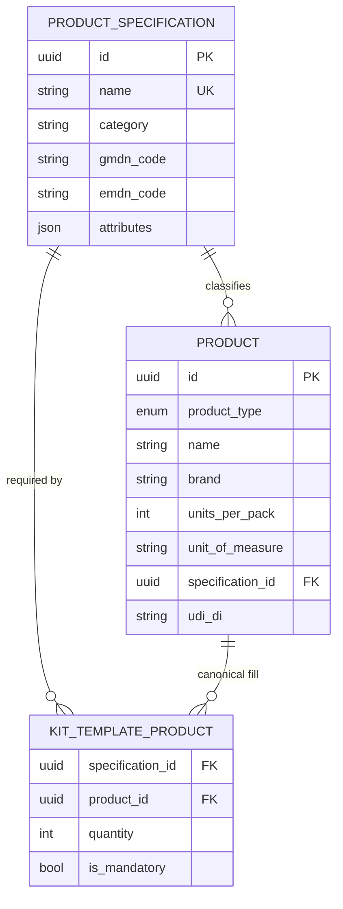

# ERD

## Key relationships

- **`product_specification → product`** — a specification classifies many products (brands). `product.specification_id` is nullable until a SKU is mapped.
- **`product_specification → kit_template_product`** — a kit line requires a specification; any product of that spec satisfies it.
- **`product → kit_template_product`** — the optional "canonical fill" (the preferred brand), used for defaults and quoting, not for compliance.
